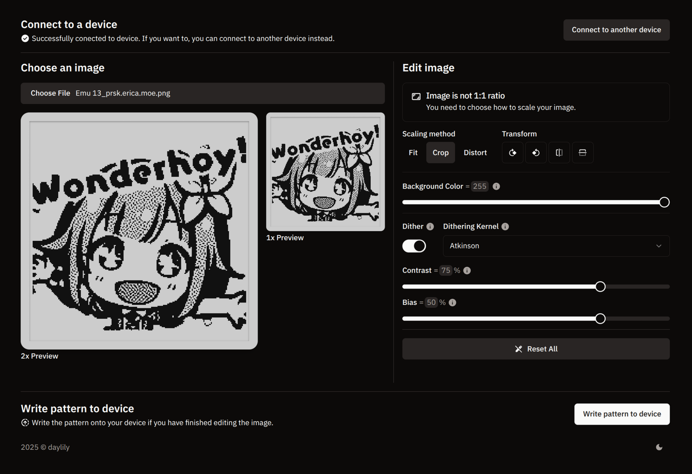

# Write to Inkclip

Write to Inkclip is a web application for writing patterns onto the Inkclip device. It handles the conversion from any raster image format supported by the user's web browser into a format that is understood by the Inkclip firmware, and then sends this data to the connected Inkclip via WebHID.

This application also supports some primitive image editing functions, such as scaling and cropping, rotation and mirroring, the adjustment of contrast and brightness, and a range of dithering algorithms available to use for converting images to black-and-white.

## Building

Run `npm run dev` under this directory in order to spin up a Vite development server, and run `npm run build` to bundle the application.

## Technical matters

Write to Inkclip depends on the [WebHID API](https://developer.mozilla.org/en-US/docs/Web/API/WebHID_API) to send data to devices. As a consequence, it is only supported on Chromium-based browsers, which are the only browsers that support WebHID at this time.

Write to Inkclip is a fully client-side application. It is built with [Svelte](https://svelte.dev), [shadcn-svelte](https://next.shadcn-svelte.com), [Vite](https://vite.dev), and [Tailwind CSS](https://tailwindcss.com). An instance of Write to Inkclip is hosted at https://inkclip.dayli.ly.
